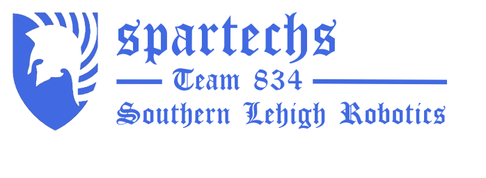

# MLFlex

## Introduction

First, I want to get something out of the way. MLFlex is not flexing machine learning vision. The project was named MLFlex because the main goal of the project was to give flexibility in the training tools while having freedom in labeling tools.

## Project Goals

- Provide ability to convert multiple annotations to PascalVOC format and back for training
- Generate code files automatically for the RoboRio and Raspberry Pi
- Possibly also handle running the training commands in the background automatically (future)

## Command Documentation

### **supervisely2pascal&#46;py**

usage: supervisely2pascal&#46;py [-h] -i INPUT_FOLDER -o OUTPUT_FOLDER [-j] [-c] [-d] [-f] [-a]

optional arguments:

&nbsp;&nbsp;&nbsp;&nbsp;-j, --join - If parameter is specified, then if multiple
                        Supervisely projects exist in the same folder, they
                        will be joined into a single .zip instead of
                        individual .zip files

&nbsp;&nbsp;&nbsp;&nbsp;-c, --cleanup         If parameter is specified, then the input Supervisely
                        path will be automatically deleted after use

&nbsp;&nbsp;&nbsp;&nbsp;-d, --debug           If parameter is specified, then the temporary folders
                        will be left for examination

&nbsp;&nbsp;&nbsp;&nbsp;-f, --feedback        If parameter is specified, then the feedback will be
                        provided during the conversion process

&nbsp;&nbsp;&nbsp;&nbsp;-a, --augmentation    If parameter is specified, then additional flipped and
                        cropped versions of the images and annotations will be
                        included in the output

required arguments:

&nbsp;&nbsp;&nbsp;&nbsp;-i INPUT, --input INPUT
                        Input path to the folder containing the Supervisely
                        annotations.

&nbsp;&nbsp;&nbsp;&nbsp;-o OUTPUT, --output OUTPUT
                        Output path for the .zip file

### **generate_code&#46;py**

usage: generate_code&#46;py [-h] -t TAG_LIST [TAG_LIST ...] -i INSTANCE_LIST
                        [INSTANCE_LIST ...] -c COLOR_SCHEME [COLOR_SCHEME ...]
                        -n TEAM_NUMBER -m MODEL_NAME -o OUTPUT_PATH
                        [--neural_compute_stick] [-p] [-s] [-d] [-ds]

MLFlex: A quick and easy annotation manipulation tool. Code file generator

optional arguments:

&nbsp;&nbsp;&nbsp;&nbsp;--neural_compute_stick: If we're using a compute stick accelerator

&nbsp;&nbsp;&nbsp;&nbsp;-p, --no_printed_info: Do you want the information to be not printed?  

&nbsp;&nbsp;&nbsp;&nbsp;-s, --streamer: If you want to have a stream of the output (debugging only)

&nbsp;&nbsp;&nbsp;&nbsp;-d, --dashboard_confidence: If you want to have the threshold on the Smart Dashboard

&nbsp;&nbsp;&nbsp;&nbsp;-ds, --dashboard_streaming: If you want to have a labeled stream over NetworkTables

required arguments:

  -t TAG_LIST [TAG_LIST ...], --tag_list TAG_LIST [TAG_LIST ...]:
                        List of objects (name)

  -i INSTANCE_LIST [INSTANCE_LIST ...], --instance_list INSTANCE_LIST [INSTANCE_LIST ...]:
                        Maximum allowed objects of each name

  -c COLOR_SCHEME [COLOR_SCHEME ...], --color_scheme COLOR_SCHEME [COLOR_SCHEME ...]:
                        List of box colors. Begins with default color then
                        starts with the color of the bounding boxes for the
                        first object. In BGR format, with color intensity
                        being from 0-255

  -n TEAM_NUMBER, --team_number TEAM_NUMBER:
                        The team number

  -m MODEL_NAME, --model_name MODEL_NAME:
                        The name of the model being used

  -o OUTPUT_PATH, --output_path OUTPUT_PATH:
                        Output path for the code files

### **pascal2pascal&#46;py**

usage: pascal2pascal&#46;py [-h] -i INPUT_FOLDER -o OUTPUT_FOLDER [-j] [-c] [-d] [-f]

optional arguments:

&nbsp;&nbsp;&nbsp;&nbsp;-c, --cleanup:         If parameter is specified, then the input folder path will be automatically deleted after use

&nbsp;&nbsp;&nbsp;&nbsp;-d, --debug:           If parameter is specified, then the temporary folders will be left for examination

&nbsp;&nbsp;&nbsp;&nbsp;-f, --feedback:        If parameter is specified, then the feedback will be provided during the conversion process

&nbsp;&nbsp;&nbsp;&nbsp;-p, --prepare_dataset:    If parameter is specified, then the files will also be copied into a dataset for training. Requires the output argument.

required arguments:

&nbsp;&nbsp;&nbsp;&nbsp;-i INPUT, --input INPUT:
                        Input path to the folder containing the data to be converted.

&nbsp;&nbsp;&nbsp;&nbsp;-o OUTPUT, --output OUTPUT:
                        Output path for the converted data. All images will be copied here as well. If nothing is specified, then the .xmls in the input directory will be modifed.

### **pascal2ndjson&#46;py**

usage: pascal2ndjson&#46;py [-h] -i INPUT_FOLDER -o OUTPUT_FOLDER [-c] [-f]

optional arguments:

&nbsp;&nbsp;&nbsp;&nbsp;-c, --cleanup:         If parameter is specified, then the input folder
                        will be automatically deleted after use

&nbsp;&nbsp;&nbsp;&nbsp;-f, --feedback:        If parameter is specified, then the feedback will be
                        provided during the conversion process

required arguments:

&nbsp;&nbsp;&nbsp;&nbsp;-i INPUT, --input INPUT:
                        Input path to the folder containing the PascalVOC
                        annotations.

&nbsp;&nbsp;&nbsp;&nbsp;-o OUTPUT, --output OUTPUT:
                        Output path for the .zip file

Note: If having issues installing the requirements.txt packages, download C++ from [this link](http://go.microsoft.com/fwlink/?LinkId=691126&fixForIE=.exe.). Make sure that both the Windows 8 and 10 SDKs are selected.